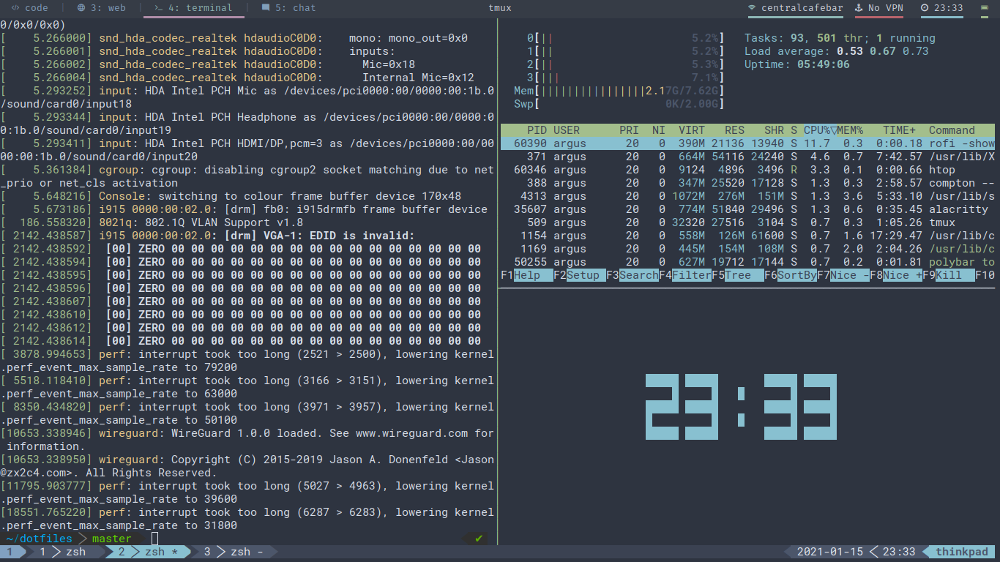

[![LinkedIn][linkedin-shield]][linkedin-url]

<br />
<p align="center">
  <h3 align="center">Dotfiles</h3>

  <p align="center">
   This is a collection of my personal configuration files.
    <br />
    
  </p>
</p>

The layout is suited best for GNU Stow - which is a symlink manager and can be
found on the [GNU Website](https://www.gnu.org/software/stow/)

You can of course choose to manage it yourself :-).

## Software Used
* [Polybar](https://github.com/polybar/polybar)
* [i3](https://i3wm.org/)
* [rofi](https://github.com/davatorium/rofi)
* [alacritty](https://github.com/alacritty/alacritty)

## Use with GNU Stow

1. ```git clone``` the repo
2. ```cd``` into the repo (default name is dotfiles)
3. run ```stow <foldername> ``` to copy that symlink
4. Or run it in a loop for all of them like so:

```bash
for dir in $(ls -d */); do stow $dir ; done
```

[linkedin-shield]: https://img.shields.io/badge/-LinkedIn-black.svg?style=flat-square&logo=linkedin&colorB=555
[linkedin-url]: https://linkedin.com/in/mpmcallister